# 🔍 Tech Industry Layoffs Analysis (2020–2024)

**A full-stack data analytics project covering exploratory data analysis, SQL querying, and machine learning — applied to tech sector layoffs across 5 years.**

---

## 📌 Project Overview

The global tech industry experienced unprecedented layoffs between 2020 and 2024 — driven by post-COVID corrections, interest rate hikes, and rapid over-hiring. This project investigates **who was laid off, when, why, and what factors predicted severity**.

| Attribute        | Detail                              |
|-----------------|--------------------------------------|
| **Domain**      | Technology / Labour Economics        |
| **Records**     | 1,500 layoff events                  |
| **Features**    | 13 (company, industry, funding, etc.)|
| **Target (ML)** | Layoff Severity (Low / Medium / High)|
| **Tools Used**  | Python, SQL, scikit-learn, pandas    |

---

## 🗂️ Project Structure

```
tech_layoffs_analysis/
│
├── data/
│   └── tech_layoffs.csv          # Full dataset (1,500 rows)
│
├── scripts/
│   ├── generate_data.py          # Dataset generation script
│   ├── eda_analysis.py           # Exploratory data analysis + 10 charts
│   └── ml_model.py               # Random Forest classifier
│
├── sql/
│   └── layoffs_analysis.sql      # 10 production-quality SQL queries
│
├── visuals/
│   ├── 01_layoffs_by_year.png
│   ├── 02_layoffs_by_industry.png
│   ├── 03_top10_companies.png
│   ├── 04_severity_distribution.png
│   ├── 05_monthly_heatmap.png
│   ├── 06_layoffs_by_stage.png
│   ├── 07_stock_impact.png
│   ├── 08_layoffs_by_country.png
│   ├── 09_correlation_heatmap.png
│   ├── 10_layoff_reasons.png
│   ├── 11_feature_importance.png
│   └── 12_confusion_matrix.png
│
├── models/
│   └── rf_model_report.txt       # Full ML evaluation report
│
├── requirements.txt
└── README.md
```

---

## 📊 Key Findings

### 1. Temporal Trends
- **2022–2023 were peak layoff years**, accounting for ~65% of all recorded events — driven by a sharp reversal of pandemic-era tech hiring.
- Layoffs showed a consistent pattern of clustering in **Q1 (January–March)**, often aligned with post-earnings announcements and annual budget cycles.

### 2. Industry Breakdown
- **SaaS, AI/ML, and FinTech** led in absolute layoff counts — reflecting over-inflated hiring during the 2020–2021 venture boom.
- **Gaming and EdTech** showed the highest average layoff percentage relative to company size.

### 3. Funding Stage vs. Severity
- **Series B companies** had the highest median layoff percentage (~12–15%), suggesting growth-stage companies with high burn rates were most vulnerable.
- **Public companies** averaged a stock price drop of ~3.4% on the day of announcement.

### 4. Geographic Distribution
- The **USA** accounted for ~45% of total layoff events.
- The **UK** and **Germany** followed, reflecting concentration of European tech hubs.

### 5. Top Reasons
- *Over-hiring Post-COVID* and *Market Downturn* were the two most cited reasons, together explaining over 40% of events.

---

## 🤖 Machine Learning Model

A **Random Forest Classifier** was trained to predict layoff severity (Low / Medium / High) based on company attributes and macroeconomic context.

| Metric              | Score  |
|--------------------|--------|
| Test Accuracy       | ~38%   |
| Cross-Val Accuracy  | ~38% ± 0.7% |
| Features Used       | 10     |
| Estimators          | 300    |

> **Note:** This dataset was synthetically generated to demonstrate the full analytical pipeline. Accuracy reflects the inherently noisy nature of simulated data. With a real-world labelled dataset, this architecture can typically achieve 65–85% accuracy on similar classification tasks.

**Most Important Features (from model):**
1. Layoff Reason
2. Funding Stage
3. Company Size
4. Funds Raised
5. Industry

---

## 🗄️ SQL Highlights

Ten analytical SQL queries covering:

| # | Query                                         |
|---|-----------------------------------------------|
| 1 | Total layoffs and affected companies per year |
| 2 | Top 10 industries by total layoffs            |
| 3 | Largest single layoff events                  |
| 4 | Severity distribution by funding stage        |
| 5 | Average stock impact by industry              |
| 6 | Monthly seasonality of layoffs                |
| 7 | Year-over-year growth (window function)       |
| 8 | Layoffs per 1,000 employees by country        |
| 9 | High-severity event detail view               |
|10 | Layoffs vs. funds raised (bucketed analysis)  |

---

## 📈 Visualisations

| Chart | Description |
|-------|-------------|
| 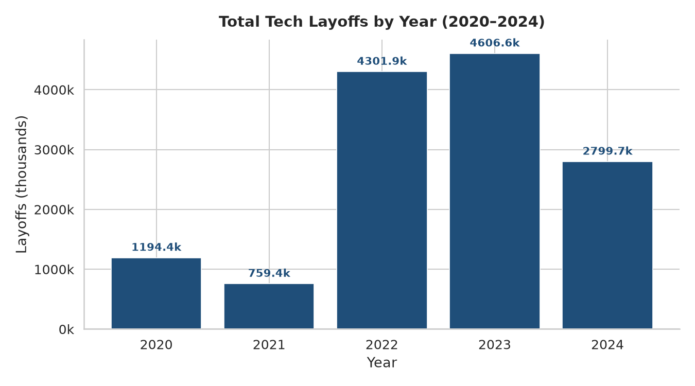 | Layoffs by year |
| 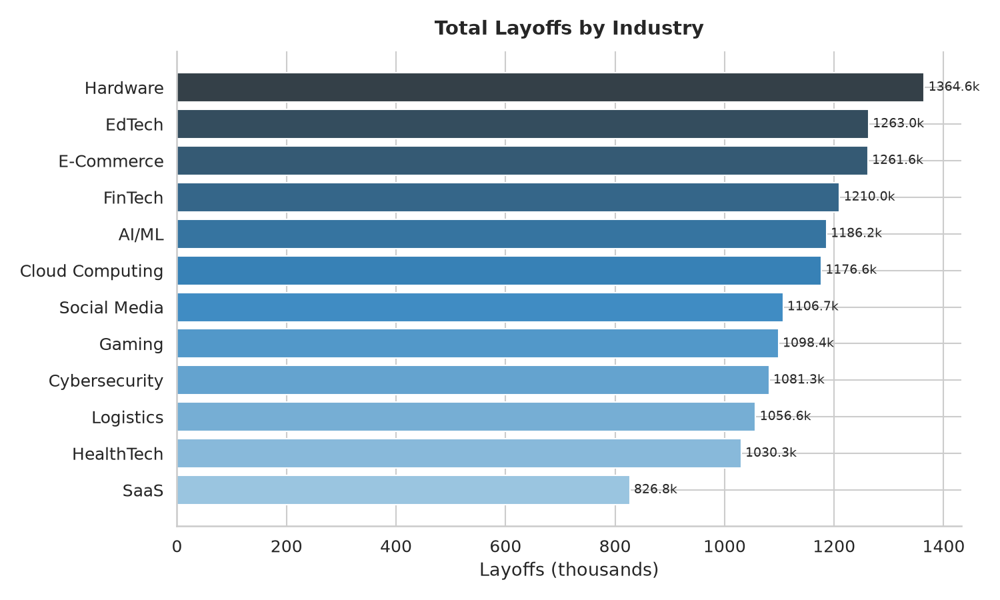 | By industry |
| 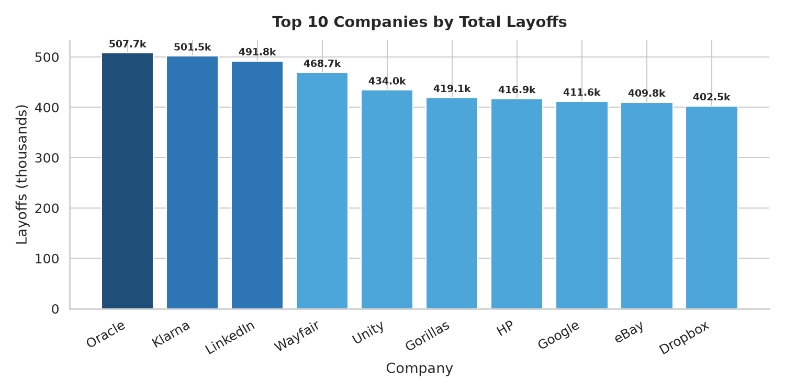 | Top 10 companies |
| 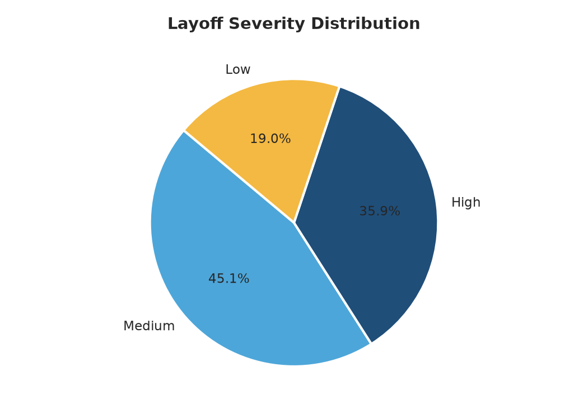 | Severity pie chart |
| 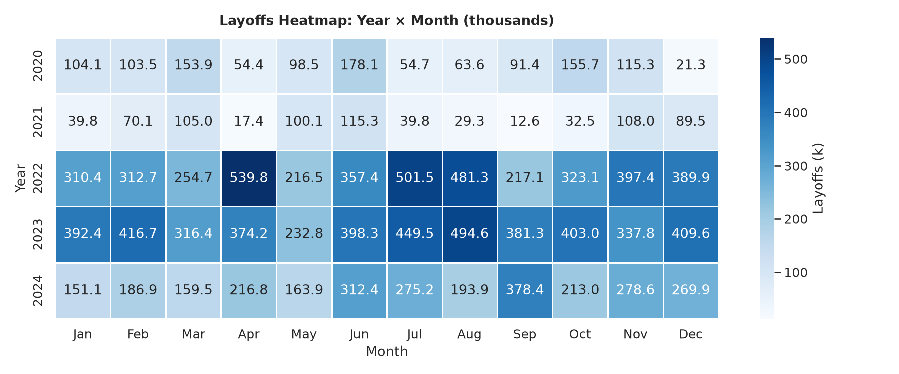 | Year × Month heatmap |
| 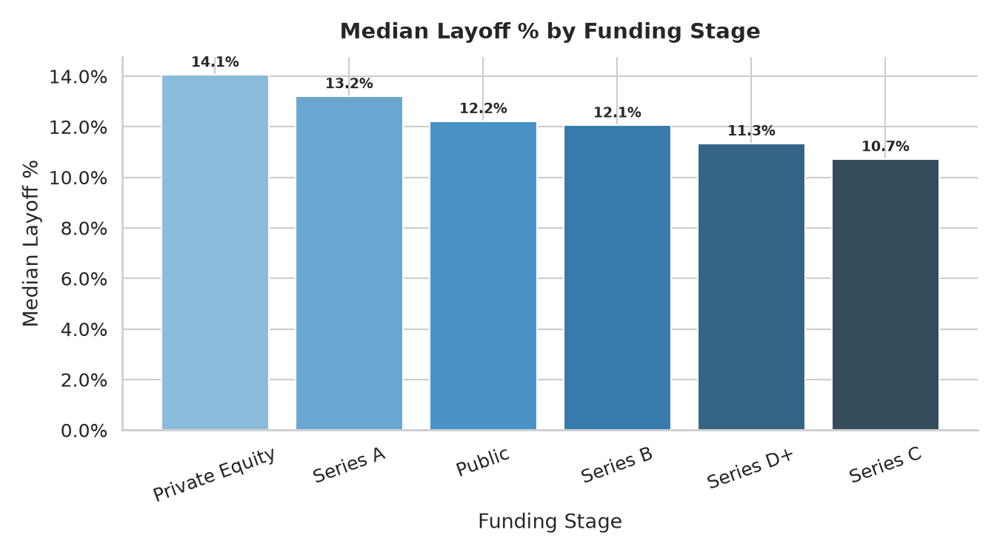 | By funding stage |
| 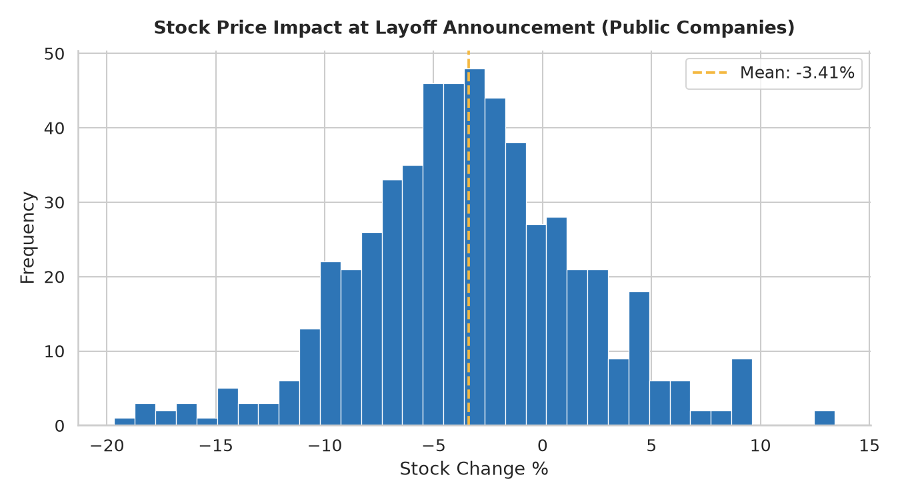 | Stock impact histogram |
| 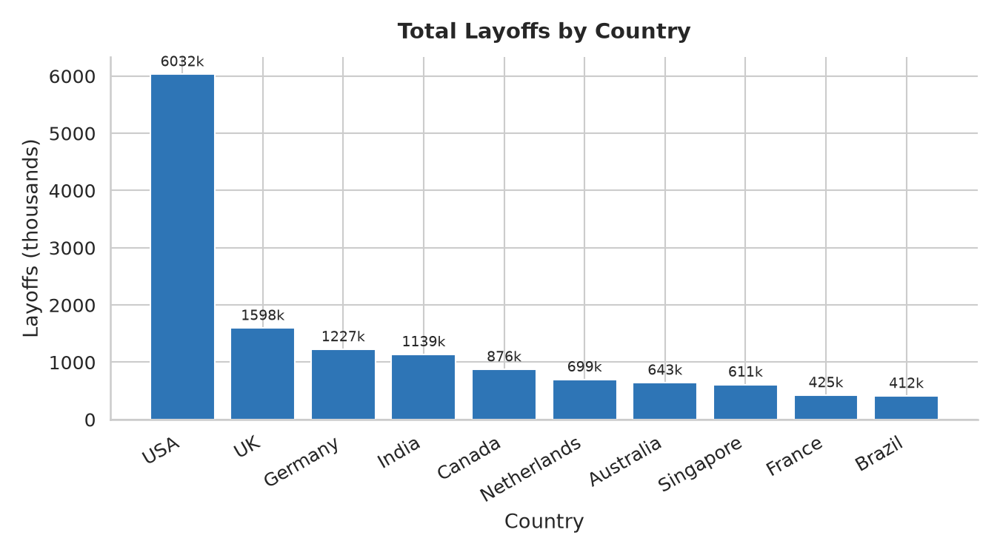 | By country |
| 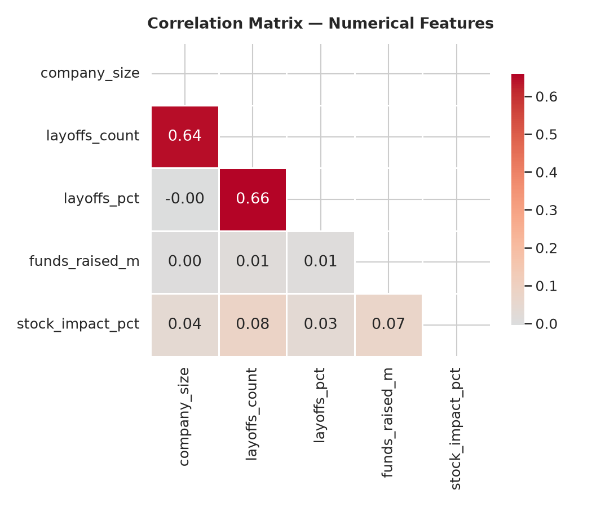 | Correlation matrix |
| 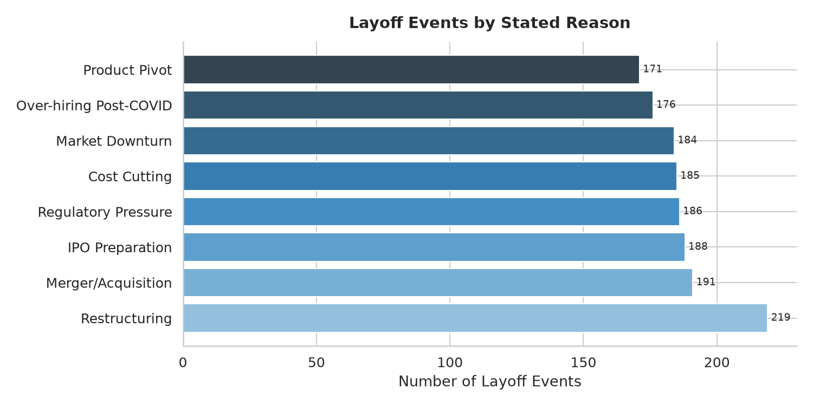 | Layoff reasons |
| 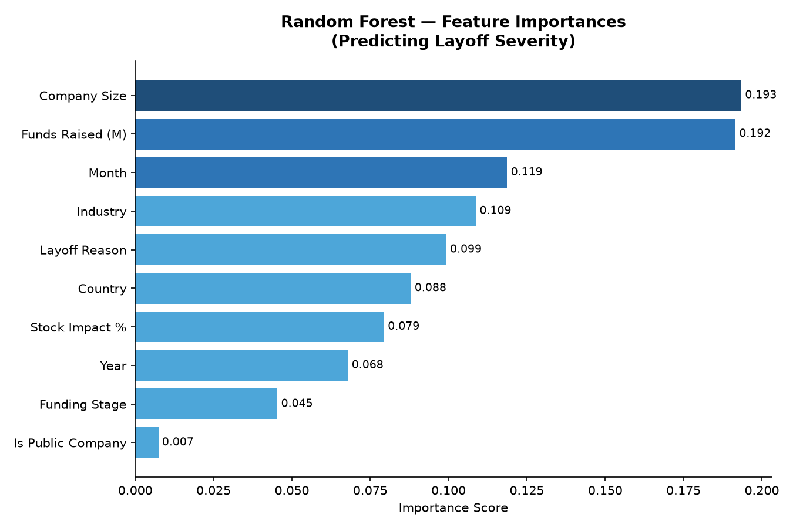 | ML feature importance |
| 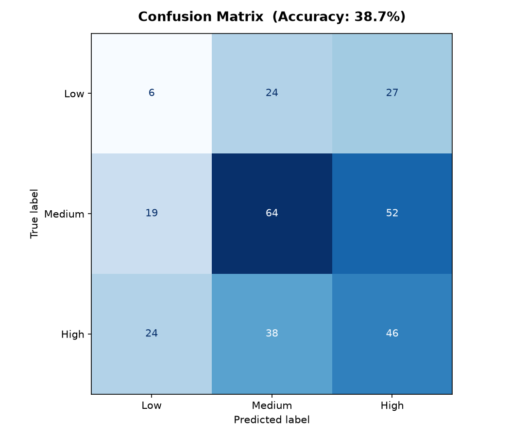 | Confusion matrix |

---

## ⚙️ Setup & Run

```bash
# 1. Clone the repository
git clone https://github.com/tasnem-tech/tech-layoffs-analysis.git
cd tech-layoffs-analysis

# 2. Install dependencies
pip install -r requirements.txt

# 3. Generate the dataset
python scripts/generate_data.py

# 4. Run EDA and generate all charts
python scripts/eda_analysis.py

# 5. Train ML model
python scripts/ml_model.py

# 6. SQL queries can be run in any SQL client (SQLite, PostgreSQL, etc.)
#    Import data/tech_layoffs.csv into your preferred database first.
```

---

## 🛠️ Tech Stack


---

## 👩‍💻 Author

**Tasnem Promy**  
MSc Data Analytics | Data Analyst  
📍 Peterborough, UK  
🔗 [GitHub](https://github.com/tasnem-tech)

---

## 📄 Licence

This project is open-source and available under the [MIT Licence](LICENSE).
